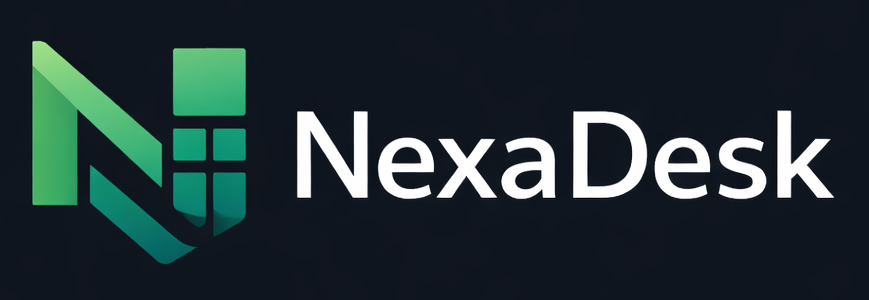

# 🚀 NexaDesk — B2B Enterprise Dashboard

<div align="center">



**A professional B2B SaaS dashboard for Shopify integration, focused on email centralization, order management, and structured refund control with AI-powered automation.**

[](https://reactjs.org/)
[](https://www.typescriptlang.org/)
[](https://vitejs.dev/)
[](https://socket.io/)
[](LICENSE)

**Developer:** [Matheus Schumacher](https://github.com/matheusschumacher) | **Year:** 2026

[Features](#-core-features) • [Quick Start](#-quick-start) • [Configuration](#%EF%B8%8F-configuration) • [Architecture](#-architecture) • [Security](#-security--best-practices)

</div>

---

## 📋 Table of Contents

- [Overview](#-overview)
- [Core Features](#-core-features)
- [Tech Stack](#-tech-stack)
- [Quick Start](#-quick-start)
- [Configuration](#%EF%B8%8F-configuration)
- [Project Structure](#-project-structure)
- [Architecture](#-architecture)
- [Security & Best Practices](#-security--best-practices)
- [Development](#-development)
- [Deployment](#-deployment)
- [License](#-license)

---

## 🎯 Overview

**NexaDesk** is a comprehensive B2B Enterprise Dashboard designed specifically for Shopify integration. It provides a centralized hub for managing customer communications, orders, refunds, and support tickets with intelligent AI automation.

### Key Highlights

- 🤖 **AI-Powered Customer Simulation** using Google Gemini 2.5 Flash
- 🌍 **Real-time Translation** with DeepL API (EN ↔ PT)
- 🔄 **Live WebSocket Integration** via Socket.IO
- 🎨 **Premium UI/UX** with Framer Motion, GSAP, and Lenis smooth scroll
- 🏢 **Enterprise-Grade** features for B2B operations

---

## ✨ Core Features

### 📧 Intelligent Inbox Management
- **Real-time Email Synchronization** via WebSocket
- **AI-Powered Translation** (English ↔ Portuguese) with DeepL integration
- **Thread Management** with email history tracking
- **Auto-translate Reply** feature with original text preservation
- **Status Tracking** (New, Pending, Replied)

### 🤖 AI Customer Simulation
- **4 Distinct AI Personas** with unique personalities and behaviors:
  - **Sarah Chen** 🎯 — Direct, data-driven tech executive
  - **John Smith** ⏱️ — Impatient operations manager
  - **Emily Rodriguez** 😊 — Friendly, appreciative marketing director
  - **David Kim** 📊 — Analytical finance manager
- **Dynamic Responses** using Gemini 2.5 Flash model
- **Context-Aware Interactions** based on ticket content
- **Strict English-only** enforcement for professional communication

### 🎫 Advanced Ticket System
- **Multi-category Support** (Questions, Technical, Payments, Features)
- **Priority Management** (High, Medium, Low)
- **Status Workflow** (Open, In Progress, Resolved)
- **Offline AI Triage** for priority classification
- **Saved Filter Presets** for power users

### 🛒 Orders & Refunds
- **Order Management Dashboard** with visual tracking
- **Refund Risk Assessment** with AI-powered scoring
- **Payment Terms** (NET 30/60/90)
- **Credit Management** for enterprise clients

### 👥 User & Company Management
- **Registration with Global Country Support** (195+ countries with flag icons)
- **CNPJ Auto-fill** via BrasilAPI for Brazilian companies
- **Multi-role Support** (Client, Support, Admin)
- **Company Profiles** with credit limits

### 🌐 Internationalization
- **DeepL Translation Service** with caching and debouncing
- **Multi-language Support** (English, Portuguese)
- **Country Selection** with visual flag indicators (powered by FlagCDN)

### 🎨 Premium UI/UX
- **Command Palette** (⌘K / Ctrl+K) for global search
- **Toast Notifications** with Sonner
- **Smooth Scroll** with Lenis
- **Scroll-driven Animations** using GSAP ScrollTrigger
- **3D Hero Elements** with React Three Fiber
- **Dark Mode** design system
- **Responsive Design** (Desktop + Mobile optimized)

---

## 🛠️ Tech Stack

### Frontend
- **React 19.2** — UI library
- **TypeScript 5.9** — Type safety
- **Vite 7.2** — Build tool
- **React Router 7** — Client-side routing

### Animation & 3D
- **Framer Motion 12** — Component animations
- **GSAP 3** — Scroll-triggered animations
- **Lenis** — Smooth scrolling
- **React Three Fiber** — 3D graphics with Three.js

### Real-time & API
- **Socket.IO 4.7** — WebSocket communication
- **Google Gemini 2.5 Flash** — AI customer simulation
- **DeepL API** — Translation service
- **BrasilAPI** — CNPJ validation and auto-fill

### UI Components
- **Lucide React** — Icon library
- **Recharts** — Data visualization
- **Sonner** — Toast notifications
- **cmdk** — Command palette
- **country-list** — Country data

### Backend
- **Node.js + Express** — Development server
- **Socket.IO Server** — Real-time events

---

## 🚀 Quick Start

### Prerequisites
- **Node.js** 18+ 
- **npm** or **yarn**
- **Git**

### Installation

1. **Clone the repository**
```bash
git clone https://github.com/matheusschumacher/B2B-SAAS-CODE-CHALLENGE.git
cd B2B-SAAS-CODE-CHALLENGE
```

2. **Install dependencies**
```bash
npm install
```

3. **Configure environment variables**
```bash
cp .env.example .env
```
Edit `.env` with your API keys (see [Configuration](#%EF%B8%8F-configuration))

4. **Start development server**
```bash
npm run dev
```

This will start:
- **Vite Dev Server** on `http://localhost:5173`
- **Socket.IO Server** on `http://localhost:3001`

5. **Open in browser**
```
http://localhost:5173
```

### Default Login
- **Email:** `demo@empresa.com`
- **Password:** Any password (mock authentication)

---

## ⚙️ Configuration

### Environment Variables

Create a `.env` file in the root directory:

```env
# Google Gemini API (for AI Customer Simulation)
VITE_GEMINI_API_KEY_ENCRYPTED=<your_encrypted_key>

# DeepL API (for Translation)
VITE_DEEPL_API_KEY_ENCRYPTED=<your_encrypted_key>
```

### Encrypting API Keys

For security, API keys are encrypted using XOR cipher:

```bash
node scripts/encrypt_key.js
# Follow prompts to encrypt your API key
# Paste the encrypted result into .env
```

### Getting API Keys

1. **Google Gemini**
   - Visit: https://makersuite.google.com/app/apikey
   - Create a new API key
   - Enable "Gemini 2.5 Flash" model

2. **DeepL**
   - Visit: https://www.deepl.com/pro-api
   - Sign up for free tier (500,000 chars/month)
   - Copy your API key from account settings

### Vite Proxy Configuration

The DeepL API is proxied through Vite to avoid CORS issues:

```typescript
// vite.config.ts
export default {
  server: {
    proxy: {
      '/api/deepl': {
        target: 'https://api-free.deepl.com',
        changeOrigin: true,
        rewrite: (path) => path.replace(/^\/api\/deepl/, '')
      }
    }
  }
}
```

---

## 📁 Project Structure

```
B2B-SAAS-CODE-CHALLENGE/
├── public/                    # Static assets
│   ├── brand-logo.png
│   ├── icon.png
│   └── socket.io.min.js
├── server/                    # Socket.IO backend
│   ├── server.js             # WebSocket server
│   └── package.json
├── scripts/                   # Utility scripts
│   ├── encrypt_key.js        # API key encryption
│   └── debug_gemini.js       # Gemini API testing
├── src/
│   ├── components/
│   │   ├── ai/               # AI-related components
│   │   │   ├── AIReplyAssistant.tsx
│   │   │   └── RiskScoreModal.tsx
│   │   ├── animations/       # GSAP & Framer Motion
│   │   │   ├── ScrollReveal.tsx
│   │   │   └── SplitTextReveal.tsx
│   │   ├── layout/           # Layout components
│   │   │   ├── Sidebar.tsx
│   │   │   └── Header.tsx
│   │   └── ui/               # Reusable UI components
│   │       ├── Button/
│   │       ├── Card/
│   │       ├── Input/
│   │       ├── Modal/
│   │       ├── Select/       # Custom country selector
│   │       └── Toast/
│   ├── context/
│   │   └── AppContext.tsx    # Global state management
│   ├── data/
│   │   ├── mockData.ts       # Mock companies, orders
│   │   └── supportTickets.ts # Ticket data
│   ├── hooks/
│   │   └── useSmoothScroll.ts
│   ├── pages/                # Route pages
│   │   ├── Landing/          # Marketing landing page
│   │   ├── Login/
│   │   ├── Register/         # Multi-country registration
│   │   ├── Dashboard/        # Main KPI dashboard
│   │   ├── Inbox/            # Email management
│   │   ├── Tickets/          # Support tickets
│   │   ├── Orders/
│   │   ├── Refunds/
│   │   ├── Quotes/
│   │   ├── Upgrade/          # Pricing plans
│   │   ├── Documentation/
│   │   └── Settings/
│   ├── services/
│   │   ├── aiCustomerService.ts    # Gemini AI integration
│   │   ├── translateService.ts     # DeepL translation
│   │   └── socketService.ts        # Socket.IO client
│   ├── types/
│   │   └── country-list.d.ts       # Type definitions
│   ├── App.tsx
│   ├── main.tsx
│   └── index.css             # Global styles
├── .env                       # Environment variables (not committed)
├── .gitignore
├── index.html                 # Entry HTML with CSP
├── package.json
├── tsconfig.json
├── vite.config.ts
└── README.md
```

---

## 🏛️ Architecture

### Frontend Architecture

```
┌─────────────────────────────────────────┐
│          React Application              │
│  ┌───────────────────────────────────┐  │
│  │      AppContext (Global State)    │  │
│  └───────────────────────────────────┘  │
│                   │                      │
│      ┌────────────┼────────────┐         │
│      │            │            │         │
│  ┌───▼───┐   ┌───▼───┐   ┌───▼───┐     │
│  │ Pages │   │Layout │   │  UI   │     │
│  └───┬───┘   └───────┘   └───────┘     │
│      │                                   │
│  ┌───▼─────────────────────────────┐    │
│  │   Services Layer               │    │
│  │  • aiCustomerService (Gemini)  │    │
│  │  • translateService (DeepL)    │    │
│  │  • socketService (Socket.IO)   │    │
│  └────────────────────────────────┘    │
└─────────────────────────────────────────┘
         │              │              │
         ▼              ▼              ▼
   [Gemini API]  [DeepL API]  [Socket.IO Server]
```

### Real-time Communication Flow

```
Client                 Server              AI Service
  │                      │                     │
  │──Create Ticket──────▶│                     │
  │                      │──Send to Queue─────▶│
  │                      │                     │
  │◀─Ticket Created─────│                     │
  │                      │◀──AI Response──────│
  │◀─New Message────────│                     │
  │                      │                     │
```

### Translation Flow

```
User Types Message → Debounce (500ms) → Check Cache 
      │                                      │
      │                               Cache Hit?
      │                                      │
      ├─────────Yes──────────────────────────┘
      │                                      
      └──No──▶ Call DeepL API ──▶ Cache Result ──▶ Display
```

---

## 🔒 Security & Best Practices

### Security Measures

#### 1. **Content Security Policy (CSP)**
Implemented in `index.html` to prevent XSS attacks:

```html
<meta http-equiv="Content-Security-Policy" content="
  default-src 'self' https://generativelanguage.googleapis.com https://api-free.deepl.com;
  script-src 'self' 'unsafe-inline' 'unsafe-eval' blob:;
  style-src 'self' 'unsafe-inline' https://fonts.googleapis.com;
  font-src 'self' https://fonts.gstatic.com;
  img-src 'self' data: https:;
  connect-src 'self' ws://localhost:* http://localhost:* https://generativelanguage.googleapis.com https://api-free.deepl.com;
" />
```

#### 2. **API Key Encryption**
- All sensitive API keys encrypted using XOR cipher
- Keys stored as base64-encoded strings in `.env`
- Decryption happens client-side in memory only
- Script: `scripts/encrypt_key.js`

#### 3. **Input Sanitization**
- No use of `dangerouslySetInnerHTML`
- TypeScript strict mode enabled
- Form validation on all user inputs

#### 4. **Type Safety**
- Full TypeScript coverage
- Custom type definitions for third-party libraries
- Strict interfaces for Socket.IO events

#### 5. **CORS Protection**
- Vite proxy for API requests
- Controlled WebSocket origins

### Code Quality

- ✅ No `console.log` in production code
- ✅ Minimal use of `any` types (typed Socket.IO interfaces)
- ✅ No `TODO` or `FIXME` comments in critical paths
- ✅ CSS-in-files over inline styles
- ✅ Component-based architecture
- ✅ Custom hooks for reusable logic

### Performance Optimizations

- **Lazy Loading**: Route-based code splitting
- **Debouncing**: Translation API calls debounced to 500ms
- **Caching**: Translation results cached in memory
- **Virtual Scrolling**: (Planned) for large lists
- **WebSocket Batching**: Multiple events batched before emit

---

## 💻 Development

### Available Scripts

```bash
# Start development (Vite + Socket.IO server)
npm run dev

# Build for production
npm run build

# Preview production build
npm run preview

# Run linter
npm run lint

# Start Socket.IO server only
npm run server
```

### Development Workflow

1. **Feature Development**
   - Create feature branch: `git checkout -b feature/your-feature`
   - Make changes and test locally
   - Ensure no TypeScript errors: `npm run lint`

2. **Testing**
   - Test all user flows (Login → Inbox → Tickets → Orders)
   - Verify WebSocket connectivity
   - Test translation with different languages
   - Verify AI responses for all personas

3. **Code Review Checklist**
   - [ ] No `console.log` statements
   - [ ] No `any` types (unless absolutely necessary)
   - [ ] All strings translated (if i18n enabled)
   - [ ] Responsive design works on mobile
   - [ ] Accessibility: keyboard navigation works

### Debug Tools

**Gemini API Test:**
```bash
node scripts/debug_gemini.js
```

**DeepL API Test:**
```bash
node scripts/debug_key.js
```

---

## 🚢 Deployment

### Build

```bash
npm run build
```

This generates a `dist/` folder ready for production.

### Environment Variables for Production

Ensure the following are set in your hosting platform:

```env
VITE_GEMINI_API_KEY_ENCRYPTED=<encrypted>
VITE_DEEPL_API_KEY_ENCRYPTED=<encrypted>
```

### Deployment Platforms

#### Vercel
```bash
npm i -g vercel
vercel deploy
```

#### Netlify
```bash
npm run build
netlify deploy --prod --dir=dist
```

#### Docker
```dockerfile
FROM node:18-alpine
WORKDIR /app
COPY package*.json ./
RUN npm ci --only=production
COPY . .
RUN npm run build
EXPOSE 5173
CMD ["npm", "run", "preview"]
```

### Server Requirements

- **Node.js**: 18+
- **RAM**: 512MB minimum
- **Storage**: 100MB for app + dependencies

### WebSocket Server Deployment

The Socket.IO server (`server/server.js`) should be deployed separately or as a background process. Update the WebSocket URL in production:

```typescript
// src/services/socketService.ts
const SOCKET_URL = process.env.NODE_ENV === 'production' 
  ? 'https://your-socket-server.com' 
  : 'http://localhost:3001';
```

---

## 📚 Additional Resources

### Documentation
- [React Documentation](https://react.dev/)
- [TypeScript Handbook](https://www.typescriptlang.org/docs/)
- [Socket.IO Guide](https://socket.io/docs/v4/)
- [Gemini API Reference](https://ai.google.dev/docs)
- [DeepL API Docs](https://www.deepl.com/docs-api)

### Design System
- **Colors**: `src/index.css` (CSS Variables)
- **Typography**: Inter font family
- **Spacing**: Based on 8px grid
- **Animations**: Framer Motion + GSAP

---

## 🤝 Contributing

Contributions are welcome! Please follow these steps:

1. Fork the repository
2. Create a feature branch
3. Commit your changes
4. Push to your fork
5. Open a Pull Request

---

## 📄 License

This project is licensed under the **MIT License**.

---

## 👨‍💻 Author

**Matheus Schumacher**
- GitHub: [@matheusschumacher](https://github.com/matheusschumacher)
- LinkedIn: [Matheus Schumacher](https://linkedin.com/in/matheusschumacher)

---

## 🙏 Acknowledgments

- **Google Gemini** for AI capabilities
- **DeepL** for translation services
- **FlagCDN** for country flag assets
- **BrasilAPI** for CNPJ validation
- **Lucide** for beautiful icons

---

<div align="center">

**Built with ❤️ by Matheus Schumacher • 2026**

[⬆ Back to Top](#-nexadesk--b2b-enterprise-dashboard)

</div>
